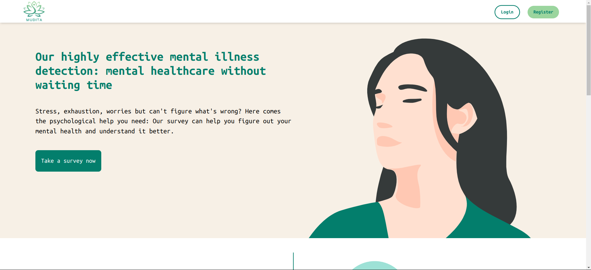
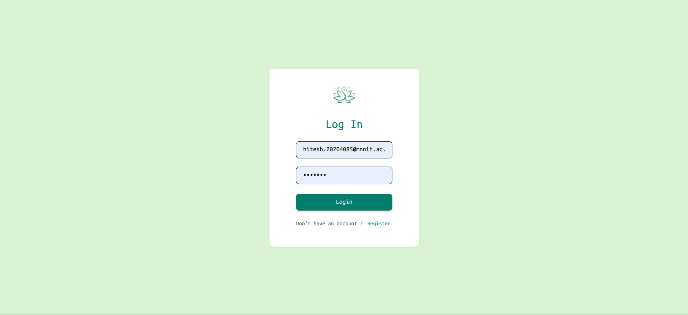
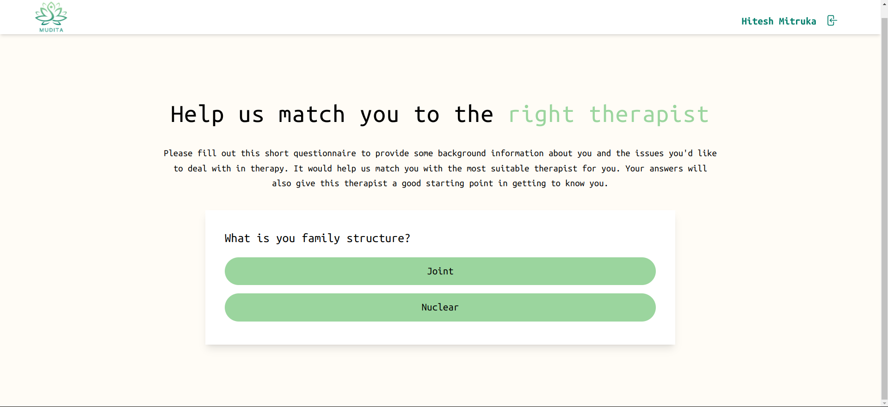
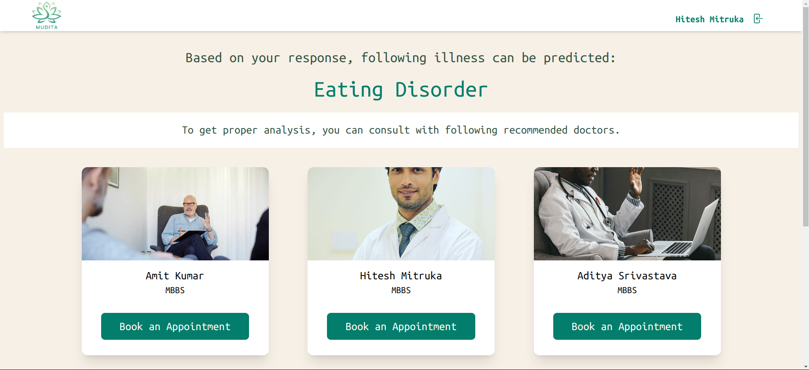
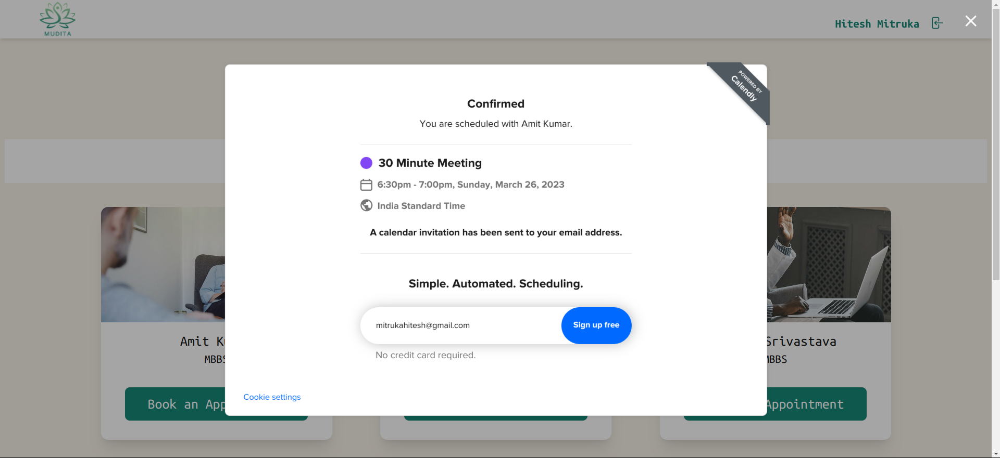

<h3 style="font-weight: bold; font-family: Arial, sans-serif;">Take the first step towards a healthier mind and happier you</h3>

 

 

 
 
 
 
 
 

## What is Mudita?

Mudita is a web application designed for the early detection of mental health issues using machine learning. It provides a user-friendly survey to predict the user's mental health condition and suggests consultants for the user to talk to. These consultants can be either free or cost a fee, depending on the user's preference. The aim of this project is to help individuals identify their mental health issues at an early stage and take necessary steps to overcome them. Mudita utilizes machine learning algorithms to analyze the survey responses and provide accurate predictions about the user's mental health. The application is user-friendly and easy to navigate, making it accessible to a wide range of users. By using Mudita, users can proactively take charge of their mental health and improve their overall well-being.

User will answer some questions and on the basis of that our model will predict his mental health. And on the basis of that we also suggest doctors.

  
## Demo Video Link:
  [Click Here](https://drive.google.com/file/d/15P-xdV40P17aeCPm2TRkKqfSZPf9wU-I/view?usp=share_link)
  
## Presentation Link:
  [Click Here](https://www.canva.com/design/DAFePNFBqQ4/pkrdkjfBaIcCQ7ZmZL64XQ/edit?utm_content=DAFePNFBqQ4&utm_campaign=designshare&utm_medium=link2&utm_source=sharebutton)
  

## Development Setup

Prerequisites
* Node v18.x
* python 3
* jupyter notebook

Clone our github repository:
``git clone https://github.com/mitrukahitesh/mudita.git`` 
``git clone https://github.com/mitrukahitesh/mudita-server.git`` 

Also add .env variables.

For frontend make a web-project on firebase-console. And download it's firebase-services.json file and add that to the secret folder inside /mudita/src .And then use :   
``npm i && npm start``

For server genrate firebase-admin file and download it. And then add it's content by making a variable in .env file. And then run the following command inside the server directory :  
``npm start``

## Team Name : Water Bottle

| Name   |      GithubProfile      |  Email-ID |
|----------|:-------------:|------:|
| Amit Kumar |  [hackeramitkumar](https://github.com/hackeramitkumar/) |amit9116260192@gmail.com |      
| Hitesh Mitruka | [mitrukahitesh](https://github.com/mitrukahitesh/)| mitrukahitesh@gmail.com  |
| Shruti varshney | [shrutivarshney](https://github.com/shrutivarshney) | shrutivarshney1424@gmail.com  | 

## Technology Stack:
   1) MERN
   3) Python
   2) machine Learning
   3) Firebase Authentication
   4) Calendly API

## Links
Backend-Server Github repository : https://github.com/mitrukahitesh/mudita-server

## Features
<ol>

  
  

  
  

  
  

</ol>

## Refrences:
* https://www.psychiatry.org/patients-families/warning-signs-of-mental-illness
* https://www.un.org/sustainabledevelopment/blog/2022/06/nearly-one-billion-people-have-a-mental-disorder-who/#:~:text=Nearly%20one%20billion%20people%20worldwide,around%20one%20in%20seven%20teenagers
* https://www.mayoclinic.org/diseases-conditions/mental-illness/symptoms-causes/syc-20374968
* https://www.betterup.com/blog/mental-health-awareness#:~:text=Mental%20health%20awareness%20is%20the,and%20their%20conditions%20go%20untreated.
* https://positivepsychology.com/mental-health-questions/
* https://www.nature.com/articles/s41380-021-01161-7
* https://www.google.com/search?q=people+ignore+mental+illness&oq=people+ignore+mental+illness&aqs=chrome..69i57.7307j0j4&sourceid=chrome&ie=UTF-8
* https://hcp.hms.harvard.edu/news/mental-illnesses-are-common-care-lacking
* https://www.nature.com/articles/s41591-022-01811-5
* Nearly 1 billion people worldwide live with a mental disorder
    * a systematic analysis for the Global Burden of Disease Study 2017. Lancet 392, 1789–1858 (2018).
* https://jonashill.org/5-signs-of-mental-illness/